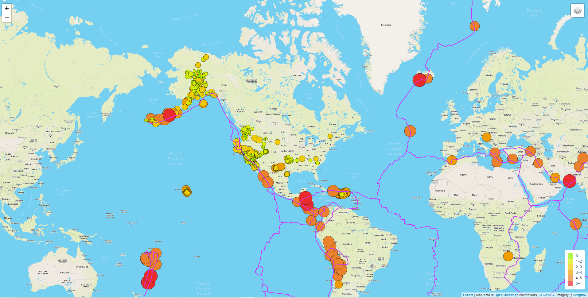
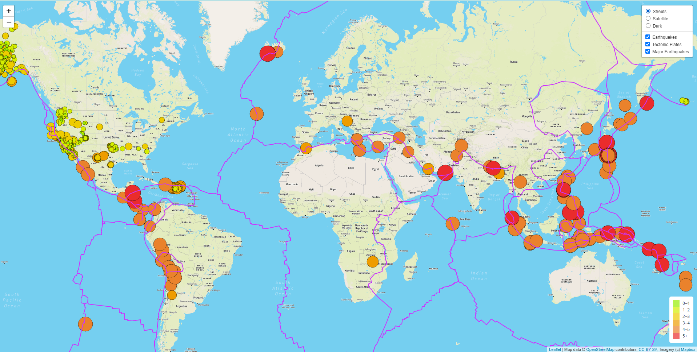
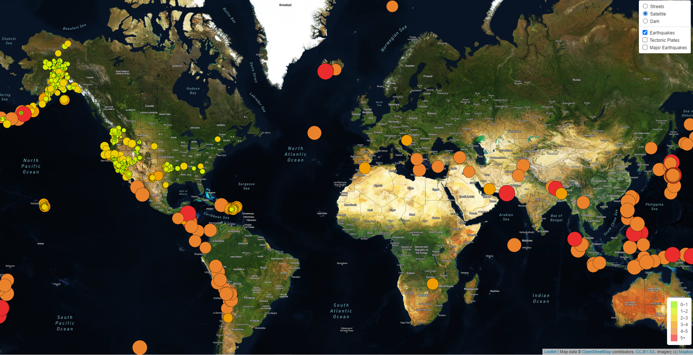
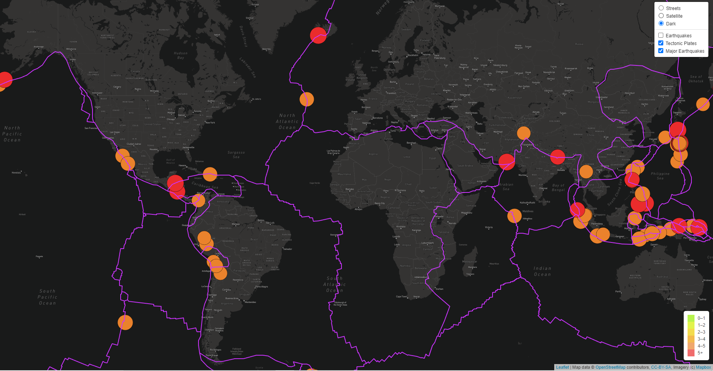

# Mapping_Earthquakes

Module 13

## Purpose

This project visually shows the differences between the magnitudes of earthquakes around the world for the last seven days.  It allows the user to toggle between three different base maps and see three different types of data.  The maps have layers for earthquakes, tectonic plates and "major" earthquakes (rated magnitude > 4.5). Each earthquake has a popup marker that shows the magnitude and the location of the earthquake when clicked.

### Examples

In the following screenshots, there are examples of (1) the page as loaded, (2) a map overview with all available selections shown, (3) a satellite view with earthquakes layer, and (4) a dark view with major earthquakes and tectonic plate layers.

1. 

2. 

3. 

4.

